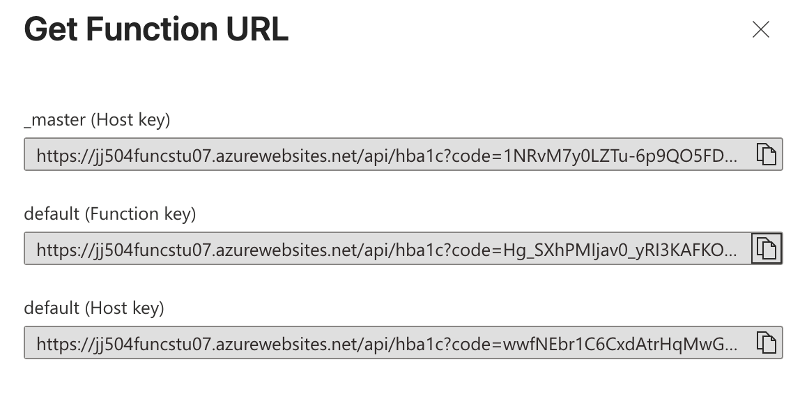
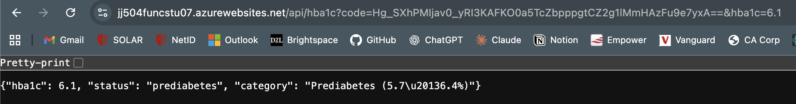
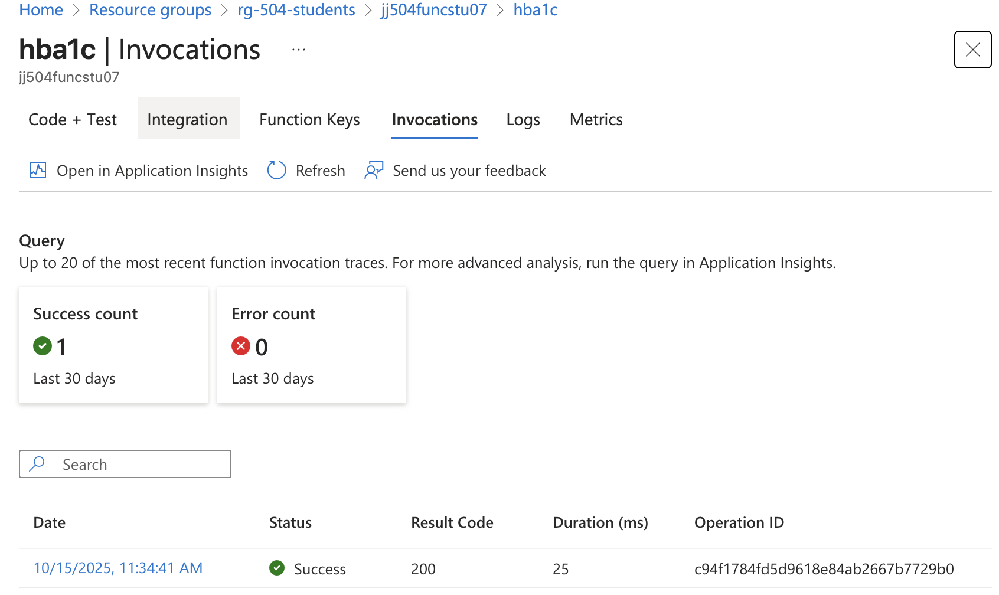
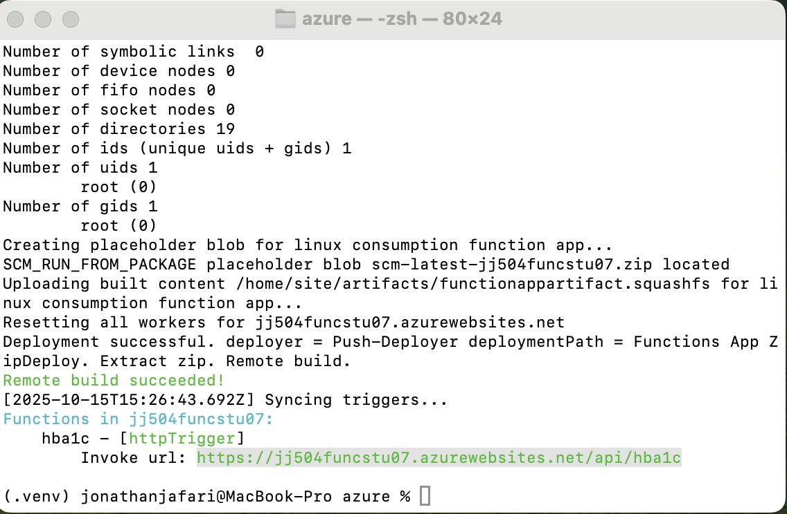
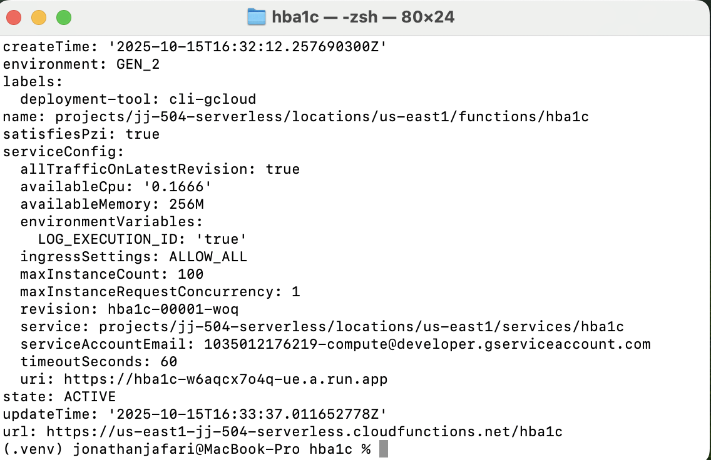
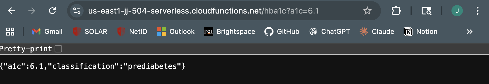
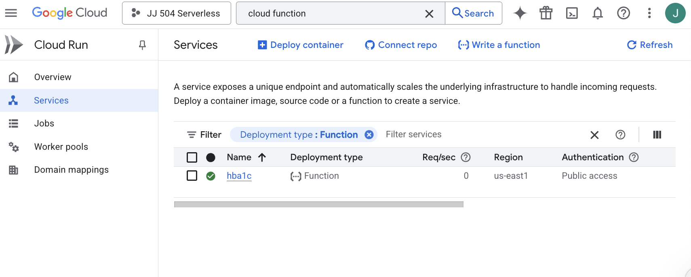
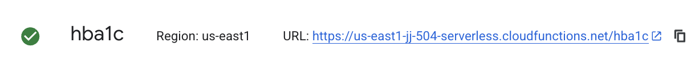
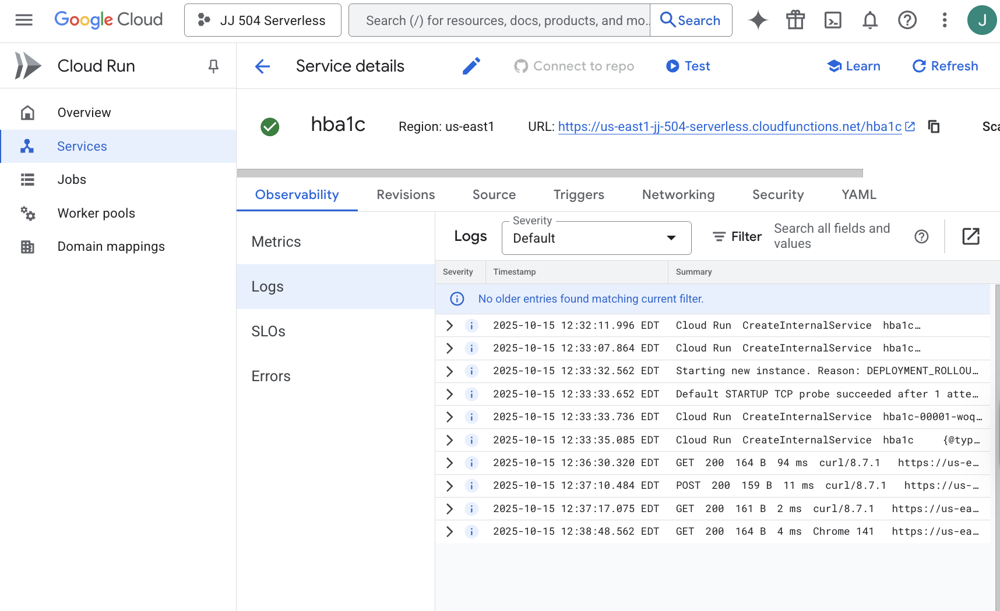

# HHA 504 – Multi-Cloud Serverless Functions

This project demonstrates a simple **HbA1c classification API** deployed across **two cloud providers** — **Microsoft Azure Functions** and **Google Cloud Functions (Gen 2)**.  

Both services return an HbA1c interpretation (`Normal`, `Prediabetes`, `Diabetes`) based on a numerical input value.

---

## Function Logic

**Input parameter**: `a1c`  
**Output**: JSON object with classification

The function classifies HbA1c based on American Diabetes Association (ADA) guidelines:  
- Normal: HbA1c < 5.7%  
- Prediabetes: 5.7% ≤ HbA1c < 6.5%  
- Diabetes: HbA1c ≥ 6.5%

**Reference:**  
American Diabetes Association. *Standards of Medical Care in Diabetes – 2024.*  
[https://doi.org/10.2337/dc24-S001](https://doi.org/10.2337/dc24-S001)


```python
if a1c < 5.7:
    return "normal"
elif a1c < 6.5:
    return "prediabetes"
else:
    return "diabetes"
```

**Example request**:
```
https://<function_url>?a1c=6.1
```

**Example response**:
```json
{"a1c": 6.1, "classification": "prediabetes"}
```

---

## Azure Functions (Python 3.11 – Linux)

| Property | Value |
|----------|-------|
| **Subscription** | Azure for Students |
| **Resource Group** | rg-504-students |
| **Storage Account** | jj504storstu07 |
| **Function App** | jj504funcstu07 |
| **Function Name** | hba1c |
| **Region** | eastus2 |
| **Invoke URL** | https://jj504funcstu07.azurewebsites.net/api/hba1c |

### Azure Screenshots

**Function URL Dialog**  


**GET Test Result (JSON Output)**  


**Logs / Invocations**  


**VS Code Terminal Deployment**  


---

## Google Cloud Functions (Gen 2)

| Property | Value |
|----------|-------|
| **Project ID** | jj-504-serverless |
| **Region** | us-east1 |
| **Runtime** | Python 3.11 (Gen 2 Environment) |
| **Trigger Type** | HTTP (public access) |
| **Service Name** | hba1c |
| **Invoke URL** | https://us-east1-jj-504-serverless.cloudfunctions.net/hba1c |

### Deployed via CLI:

```
gcloud functions deploy hba1c \
    --gen2 \
    --runtime python311 \
    --region us-east1 \
    --source . \
    --entry-point hba1c \
    --trigger-http \
    --allow-unauthenticated
```

### ✅ GCP Screenshots

**Function Deployment Output (Terminal)**  


**GET Test Result (JSON Output)**  


**Function Overview (Name, Region, Authentication)**  


**Function Details Page (Region + URL)**  


**Logs View (GET/POST Invocations)**  


---

## Azure vs. Google Cloud Comparison

Setting up Azure Functions was easier because it connects directly to VS Code and takes you through the publishing process. The Azure Portal clearly displays logs and configuration options, making it easier for beginners.

Google Cloud Functions (Gen 2) was more involved because it required billing setup and CLI commands, but it ended up being quicker to deploy once everything was configured. GCP also provides more detailed logs and performance metrics through Cloud Run.

Overall, Azure was easier to use, while Google Cloud had more control and visibility for developers.

---

## Recording

A short walkthrough demonstrating both Azure and Google Cloud Functions in action.

**Includes**:
- Function logic and test in the browser
- VS Code deployment view
- Cloud console navigation and logs verification

**Recording Link:** [Loom Recording](https://www.loom.com/share/e321a3410bdb46dc97c171db27a976b5?sid=7b73345c-f46e-4128-a6ae-08737f912740)


---

## Author

**Jonathan Jafari**  
Stony Brook University – MS Applied Health Informatics  
Course: HHA 504 – Cloud Foundations  
Semester: Fall 2025